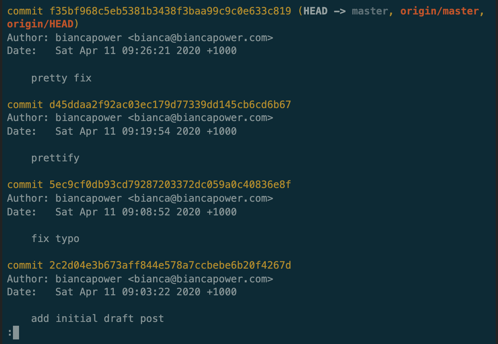

Here's the situation. Everything seems to be working well with your current code, so you do a `git commit`. Then you realise notice a small bug, or maybe you forgot to comment an important line of code, or to remove all of your `console.log`s. So you make your minor changes... and `git commit` again. Then you push to production - and let's face it, nothing 'just works' when you push to production - and now you need to make a few more minor changes, you add them, `git commit` again. Maybe this happens a few times, before you're _actually_ done with that bit of code. So now when you look at the commit history, there's the original, nicely named commit, maybe something like "implement new navbar", then there are a litter of commits following it, things like "bugfix", "please work now", "working navbar", "navbar fix AGAIN". Or maybe your commit messages are better than that, but either way, ideally, all of that code should have been part of the "implement new navbar" commit. Read on for how to do just that.

**Here's how we can combine multiple commits into one, to neaten up our git history and make it easier to see what went on.**

Below is an [asciinema](https://asciinema.org/) cast of me doing just that.



Let's talk it through. First, doing `git log` shows us the most recent commits. In this case, it's the most recent 4 commits that we want to combine. Those are shown here:

Next, quit out of git log, so we're back to the terminal.

Quick side note: After running the command in the next step, git launches us into our default text editor so that we can make some changes and specify what we want. Most systems will default to something like vi or vim, but if you're not comfortable in those environments, go and check out my article on how to change your default text editor **before** doing the next step.



Now the part we've been waiting for! We're going to run the following command:

`$ git rebase -i HEAD~4`

This is a `git` command named `rebase`, which we're going to do in interactive mode (`-i` for short), and we're doing it on the most recent 4 commits, which we specify with `HEAD~4` (HEAD is how we refer to our most recent commit). When we run that command we see:

At the top we have a list of the most recent 4 commits - the ones we want to combine. Below that, git helpfully tells us about the options we have. The option we want to use is `squash`, which will 'use commit, but meld into previous commit'. To do that, we edit the file we're in, changing 'pick' to 'squash' for just the commits we want to squash - we leave the original commit unchanged, because that's the one we want to squash the others into (in vim, hit `i` to enter insert mode). At this point we see:

Now we save and close the file (`:wq` in vim). As soon as we've done that, we get launched into another file:

Here, git wants us to specify the commit message for the combined commit. In this case, we just want the original commit message, so we need to remove (or comment out) any other text, leaving us with:

Now we save and close that file, and we're back in terminal. Doing `git log` shows us that our commit history has changed:

We see our combined commit, as well as some older commits that weren't changed.

Did you find this helpful? I'd love to hear your feedback!

# Found a typo?

If you've found a typo, a sentence that could be improved or anything else that should be updated on this blog post, you can access it through a git repository and make a pull request. Instead of posting a comment, please go directly to https://github.com/biancapower/my-dev.to and open a new pull request with your changes.
